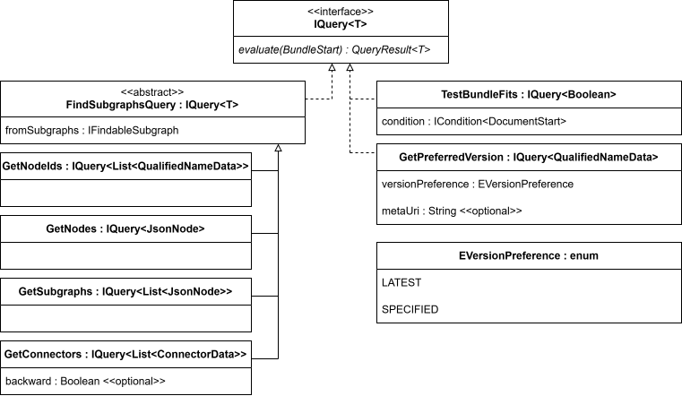
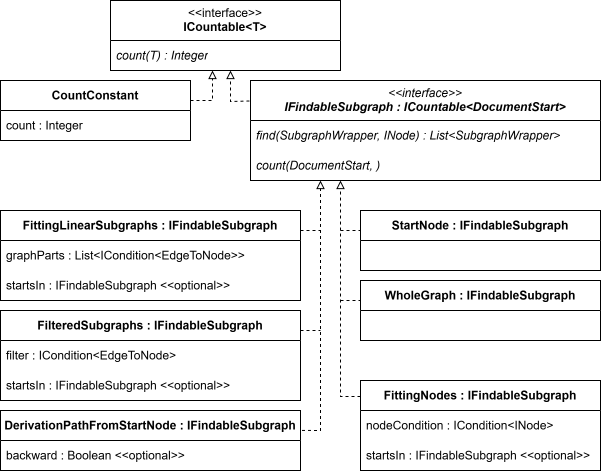
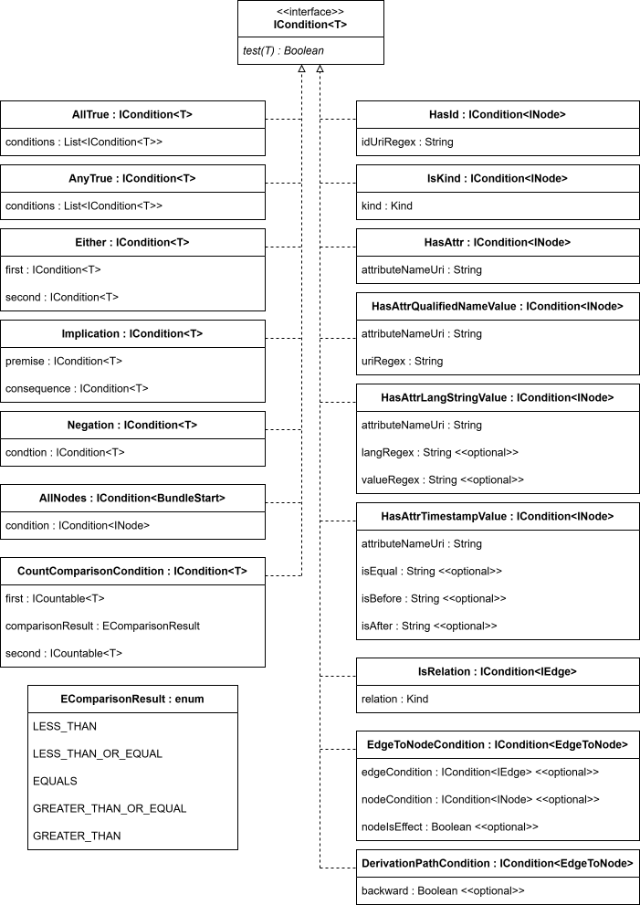

# Provenance access service

Service that should be operated under a provenance controller and can answer queries about individual bundles in the storage of this provenance controller. It is queried by a traversal service, which traverses provenance chains and fetches results of a given query for individual bundles from their respective provenance controllers.

## Running with Docker

Build the docker image from the project root directory:

```sh
docker build -t prov-access-service .
```

Run the container:

```sh
docker run -d --name pa --network cpf-net -p 8082:8080 prov-access-service
```

- `--network cpf-net`: the store must be reachable from this container.
- `--name pa` is the hostname PT uses to reach this service (`http://pa:8080/api/` in PT's `provServiceTable.json`).

By default, the service listens on port `8080`. You can change it with the `PA_SERVICE_PORT` environment variable, e.g. `-e PA_SERVICE_PORT=9090 -p 8082:9090`.

> Note: This service is normally deployed alongside a traversal service [**(PT-Service)**](https://github.com/Common-Provenance-Framework/PT-Service) and provenance storage [**(CPF-Storage)**](https://github.com/Common-Provenance-Framework/CPF-Storage) as part of the full demo setup described in the original project's README.

### Environment variables

| Variable          | Description                    | Default |
| ----------------- | ------------------------------- | ------- |
| `PA_SERVICE_PORT` | Port the service listens on.    | `8080`  |

## API documentation (Swagger)

Once the service is running, the Swagger UI is available at:

```
http://localhost:8082/swagger-ui/index.html#
```

> Note that the service container must be running for the Swagger UI to load.

The Swagger UI provides multiple executable query examples to test the service.

## Building queries

See the [PT-Service API](https://github.com/Common-Provenance-Framework/PT-Service) to list available validity checks and traversal priorities. Queries are explained further in this README.

For version preference, two options are available: `SPECIFIED` and `LATEST`.

Authorization is mocked. To be granted access to all bundles, use bearer token `full_access_token`. One other token is recognized: `denied_processing_bundle_access`, for demonstrating behavior when access to a bundle is denied.

### Query structure
The following diagrams contain information relevant for structuring a query. The methods declared in the interfaces are omitted from their implementations to save space and put emphasis on the fields that are used to specify a query.

Possible <i>Kind</i> values are listed here: https://javadoc.io/doc/org.openprovenance.prov/prov-model/latest/prov.model/org/openprovenance/prov/model/StatementOrBundle.Kind.html





